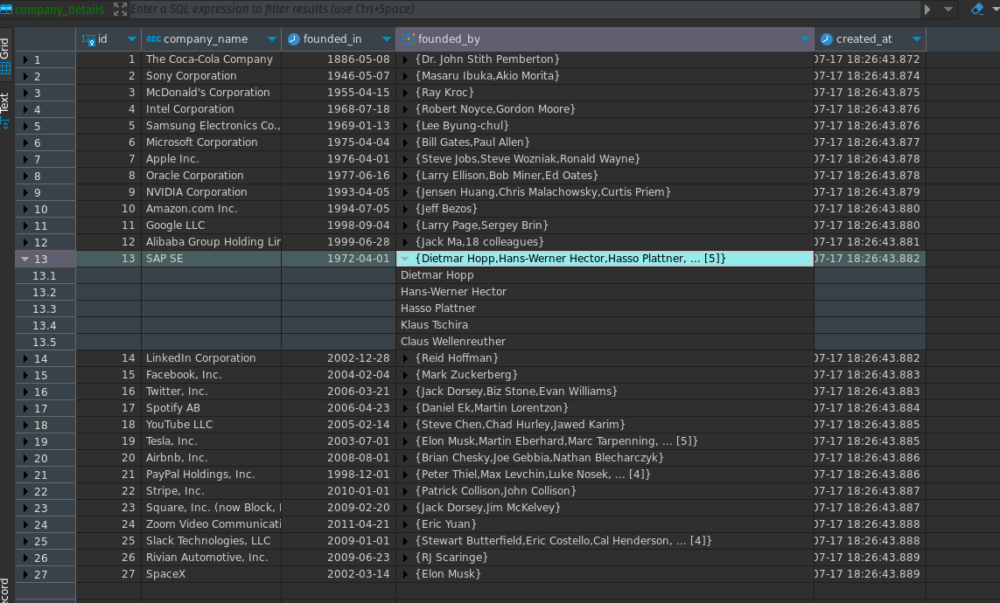

# Demo app to extract info and insert to Postgres

This exercise demonstrates how LLMs can be leveraged to extract information in a structured format, which can then be used for further processing, such as inserting into a database.

## Development Setup

- Install and activate a virtual environment

  ```sh
  source .venv/bin/activate
  ```

- Install dependencies

  ```sh
  pip install -r requirements.txt
  ```

- Run the Postgres server. You can use `docker-compose` to start postgres database.

  ```sh
  docker-compose up
  ```

- Create `.env` file in the project directory and add the environment variables

- Run the main python file to import the company info from the given prompt.

  ```sh
  python main.py
  ```

## Result

Once you run the script, you see the company info extracted from the prompt and imported to the Postgres database.


