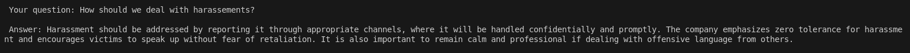

# Simple RAG Demo

This exercise demonstrates how we can extract information from documents, embed and store in vector database which then can be used together with LLM for answering domain specific queries.

## Development Setup

- Install and activate a virtual environment

  ```sh
  source .venv/bin/activate
  ```

- Install dependencies

  ```sh
  pip install -r requirements.txt
  ```

- Create `.env` file in the project directory and add the environment variables

- Add your Google service account file into `google_credentials.json` file at root directory. More info can be found [here](getting-confluence-and-google-drive-credentials.md)

- Run the following python script to import the doc and load into Chroma DB.

  ```sh
  python src/load_data_to_chroma.py
  ```

- Now run the following python script to experiment with prompts.

  ```sh
  python src/main.py
  ```

## Result



## References

- [Google Drive Loader](https://python.langchain.com/docs/integrations/document_loaders/google_drive/)

- [Google Drive loader with Service account](https://github.com/langchain-ai/langchain/issues/8755#issuecomment-1667596165)
